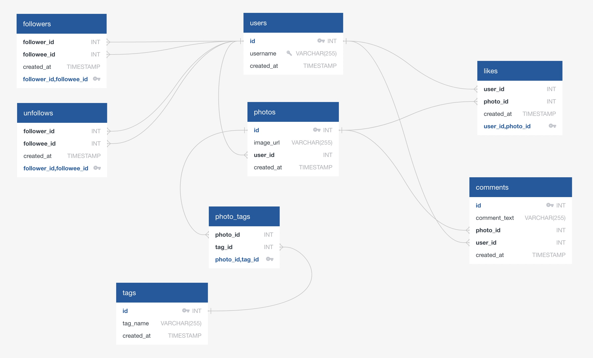

# Instagram Clone Database
## Project Overview
This project involves the creation of a clone of a basic Instagram database. The objective was to understand the underlying structure of a social media database and to utilize MySQL for database management and data querying. The project was divided into four main phases: designing the database schema, coding the database creation, populating the database with mock data, and answering business-related queries using MySQL.

## Technologies Used
- MySQL
- QuickDBD

## Phase 1: Database Design
Initially, a comprehensive database schema was designed to mimic Instagram's typical functionalities. This included tables for users, photos, comments, likes, follower relationships, unfollows, and hashtags. The schema was visualized using QuickDBD, and the design ensures efficient data retrieval.

### Schema Diagram


## Phase 2: Database Creation
The database was created using MySQL. Below are the SQL scripts used for the creation of each table:

```sql
CREATE TABLE users (
	id INT PRIMARY KEY AUTO_INCREMENT,
    username VARCHAR(255) UNIQUE NOT NULL,
    created_at TIMESTAMP DEFAULT NOW()
);

CREATE TABLE photos (
	id INT PRIMARY KEY AUTO_INCREMENT,
    image_url VARCHAR(255) NOT NULL,
	user_id INT NOT NULL,
    created_at TIMESTAMP DEFAULT NOW(),
    FOREIGN KEY(user_id) REFERENCES users(id)
);

CREATE TABLE comments (
	id INT PRIMARY KEY AUTO_INCREMENT,
    comment_text VARCHAR(255) NOT NULL,
	photo_id INT NOT NULL,
    user_id INT NOT NULL,
    created_at TIMESTAMP DEFAULT NOW(),
    FOREIGN KEY(photo_id) REFERENCES photos(id),
    FOREIGN KEY(user_id) REFERENCES users(id)
);

CREATE TABLE likes (
	user_id INT NOT NULL,
	photo_id INT NOT NULL,
    created_at TIMESTAMP DEFAULT NOW(),
    FOREIGN KEY(photo_id) REFERENCES photos(id),
    FOREIGN KEY(user_id) REFERENCES users(id),
    PRIMARY KEY(user_id, photo_id)
);

CREATE TABLE followers (
	follower_id INT NOT NULL,
    followee_id INT NOT NULL,
    created_at TIMESTAMP DEFAULT NOW(),
    FOREIGN KEY(follower_id) REFERENCES users(id),
    FOREIGN KEY(followee_id) REFERENCES users(id),
    PRIMARY KEY(follower_id, followee_id)
);

CREATE TABLE unfollows (
	follower_id INT NOT NULL,
    followee_id INT NOT NULL,
    created_at TIMESTAMP DEFAULT NOW(),
    FOREIGN KEY(follower_id) REFERENCES users(id),
    FOREIGN KEY(followee_id) REFERENCES users(id),
    PRIMARY KEY(follower_id, followee_id)
);

CREATE TABLE tags (
	id INT PRIMARY KEY AUTO_INCREMENT,
	tag_name VARCHAR(255) UNIQUE,
    created_at TIMESTAMP DEFAULT NOW()
);

CREATE TABLE photo_tags (
	photo_id INT NOT NULL,
    tag_id INT NOT NULL,
    FOREIGN KEY(photo_id) REFERENCES photos(id),
    FOREIGN KEY(tag_id) REFERENCES tags(id),
    PRIMARY KEY(photo_id, tag_id)
);
```
[IG_Database.sql](IG_Database.sql)

## Phase 3: Populating the Database with Mock Data
Mock data was generated to populate the database, reflecting a realistic set of data for testing and analysis. The data insertion was performed via SQL scripts. \
Do to the large size of the inserts, scripts can be seen within the attached file: \
[Clone Data](ig_clone_data.sql)